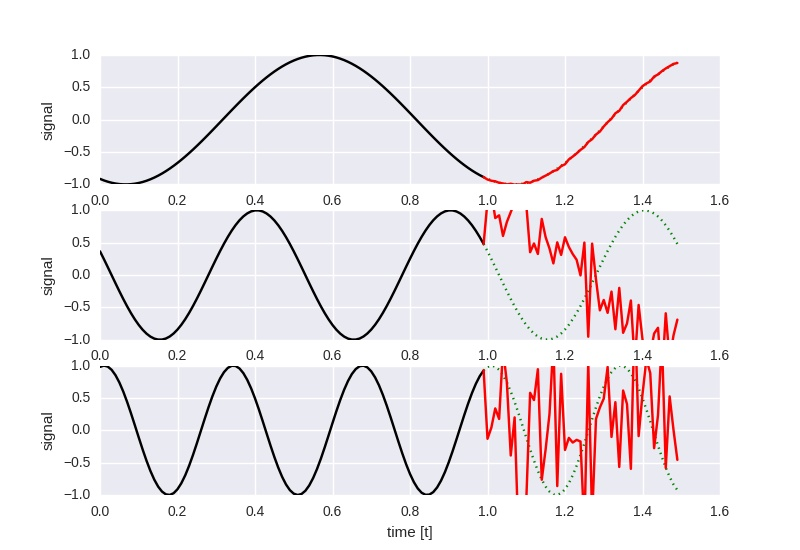
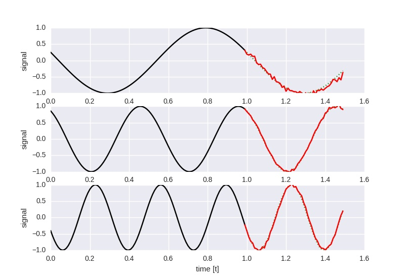
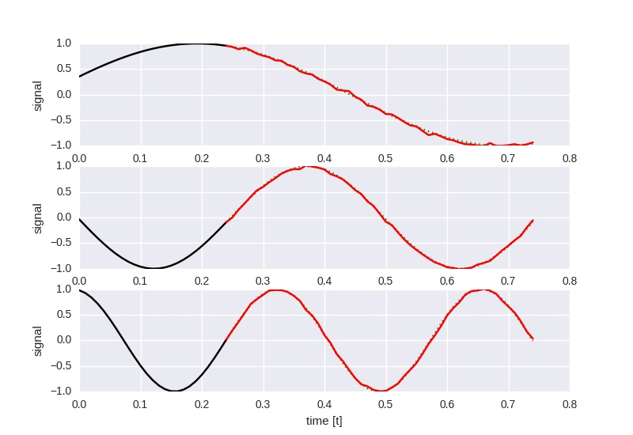
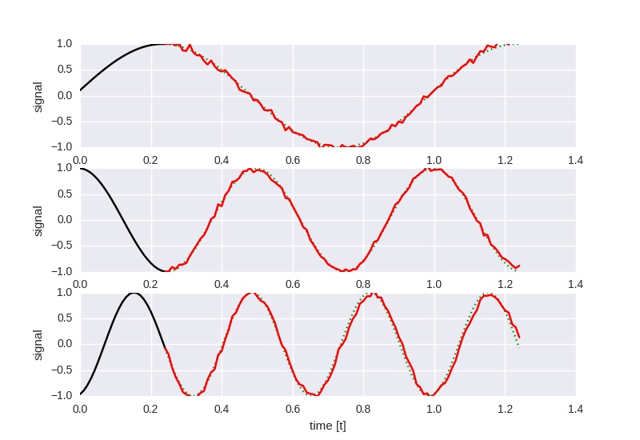
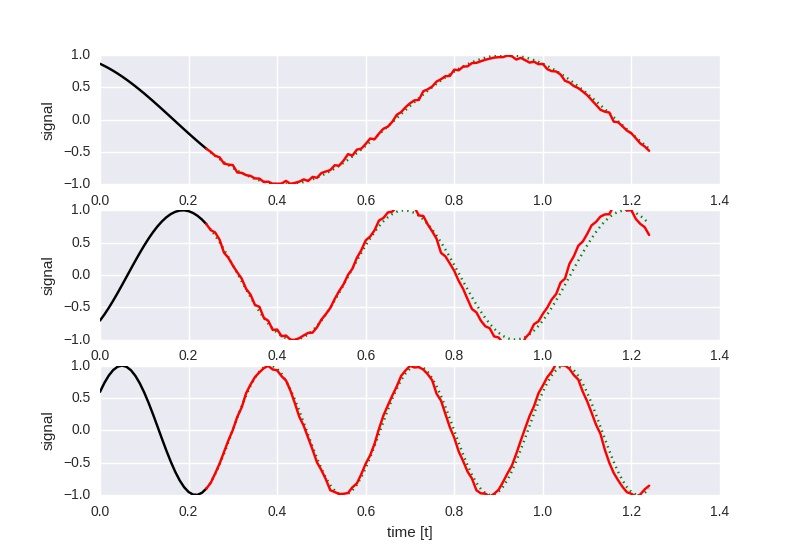
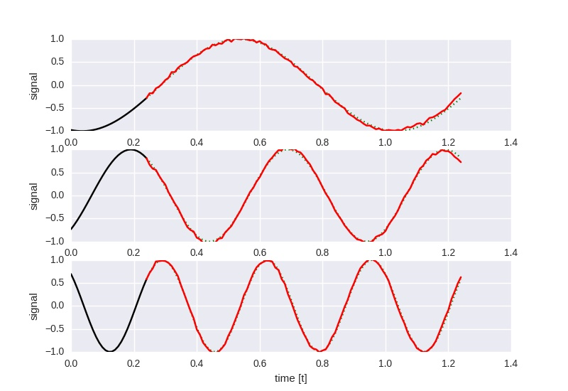
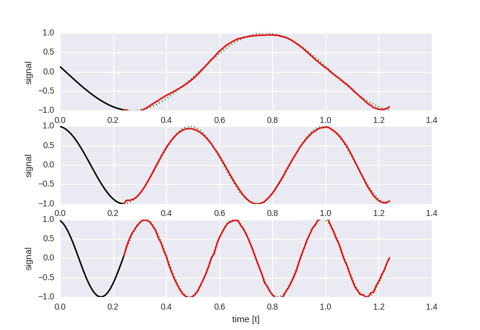

# TensorFlow LSTM sin(t) Example

Single-layer LSTM network with no output nonlinearity based on [aymericdamien's TensorFlow examples](https://github.com/aymericdamien/TensorFlow-Examples/). 
All networks have been optimized using [Adam](https://arxiv.org/abs/1412.6980) on the MSE loss function.

## Experiment 1

Given a single LSTM cell with `100` hidden states, predict the next `50` timesteps 
given the last `100` timesteps. 

The network is trained on a sine of `1 Hz` only using random shifts, thus fails on
generalizing to higher frequencies (`2 Hz` and `3 Hz` in the image); in addition, the
network should be able to simply memoize the shape of the input.
It was optimized with a learning rate of `0.001` for `200000` iterations and 
batches of `50` examples.



## Experiment 2

Given a single LSTM cell with `150` hidden states, predict the next `50` timesteps 
given the last `100` timesteps. 

The network is trained on sines of random frequencies between `0.5 .. 4 Hz` using 
random shifts. Prediction quality is worse than for the `1 Hz` only experiment above,
but it generalizes to the `2 Hz` and `3 Hz` tests.
It was optimized with a learning rate of `0.001` for `300000` iterations and 
batches of `50` examples.

At loss `0.614914`, the prediction looks like this:



## Experiment 3

Given a single LSTM cell with `150` hidden states, predict the next `50` timesteps 
given the last `25` timesteps. 

The network is trained on sines of random frequencies between `0.5 Hz` and `4 Hz` using 
random shifts. Prediction quality is worse than for the `1 Hz` only experiment above,
but it generalizes to the `2 Hz` and `3 Hz` tests.
It was optimized with a learning rate of `0.0005` for `500000` iterations and 
batches of `50` examples.

The following image shows the output at loss `0.177742`:



The following is the network trained to predict the next `100` timesteps
given the previous `25` timesteps; the parameters are otherwise unchanged.

This is the result at loss `0.257725`:



## Experiment 4

Same as the last experiment, however using `500` hidden states and gradient clipping
for the optimizer as described [here](http://stackoverflow.com/a/36501922/195651):

```python
adam = tf.train.AdamOptimizer(learning_rate=learning_rate)
gradients = adam.compute_gradients(loss)
clipped_gradients = [(tf.clip_by_value(grad, -0.5, 0.5), var) for grad, var in gradients]
optimizer = adam.apply_gradients(clipped_gradients)
```

Losses get as low as `0.069027` within the given iterations, but vary wildly.
This is at loss `0.422188`:



## Experiment 5

This time, the `dynamic_rnn()` function is used instead of `rnn()`, drastically improving the 
startup time. In addition, the single LSTM cell has been replaced with `4` stacked 
LSTM cells of `32` hidden states each.

```python
lstm_cell = rnn_cell.BasicLSTMCell(n_hidden, forget_bias=1.0)
lstm_cells = [lstm_cell]*n_layers
stacked_lstm = rnn_cell.MultiRNNCell(lstm_cells)
outputs, states = rnn.dynamic_rnn(stacked_lstm, x, dtype=tf.float32, time_major=False)
```

The output still uses linear regression:

```python
output = tf.transpose(outputs, [1, 0, 2])
pred = tf.matmul(output[-1], weights['out']) + biases['out']
```

The network is trained with learning rate `0.001` for at least `300000` iterations
(with the additional criterion that the loss should be below `0.15`).

The following picture shows the performance at loss `0.138701` at iteration `375000`.



When using only `10` hidden states, training takes much longer given a learning rate of `0.001`
and reaches a loss of about `0.5` after `~1200000` iterations, where convergence effectively stops.

The following used `10` hidden states and a base learning rate of `0.005` in combination with a 
step policy that reduced the learning rate by a factor of `0.1` every `250000` iterations.
Similar to the previous experiment, optimization was stopped after at least `300000` iterations 
have passed and the loss was below `0.2`.

The picture shows the outcome after `510000` iterations at a loss of `0.180995`:


