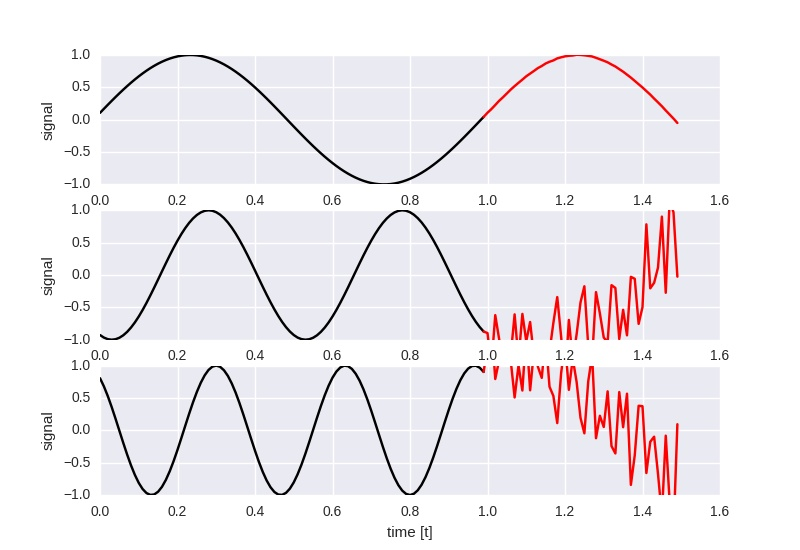
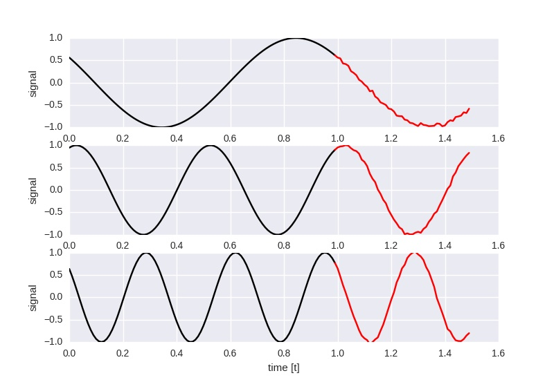
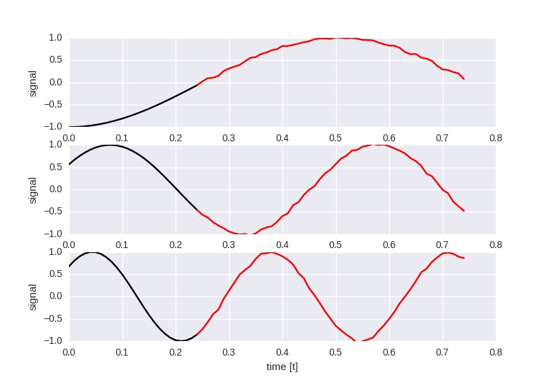
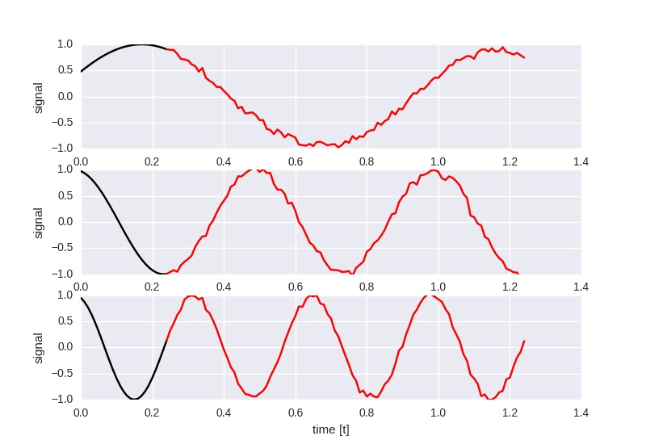

# TensorFlow LSTM sin(t) Example

Single-layer LSTM network with no output nonlinearity based on [aymericdamien's TensorFlow examples](https://github.com/aymericdamien/TensorFlow-Examples/) 
All networks have been optimized using ADAM on the MSE loss function.

## Experiment 1

Given a single LSTM cell with `100` hidden states, predict the next `50` timesteps 
given the last `100` timesteps. 

The network is trained on a sine of `1 Hz` only using random shifts, thus fails on
generalizing to higher frequencies (`2 Hz` and `3 Hz` in the image); in addition, the
network should be able to simply memoize the shape of the input.
It was optimized with a learning rate of `0.001` for `200000` iterations and 
batches of `50` examples.

## Experiment 2

Given a single LSTM cell with `150` hidden states, predict the next `50` timesteps 
given the last `100` timesteps. 

The network is trained on sines of random frequencies between `0.5 Hz` and `4 Hz` using 
random shifts. Prediction quality is worse than for the `1 Hz` only experiment above,
but it generalizes to the `2 Hz` and `3 Hz` tests.
It was optimized with a learning rate of `0.001` for `300000` iterations and 
batches of `50` examples.

## Experiment 3

Given a single LSTM cell with `150` hidden states, predict the next `50` timesteps 
given the last `25` timesteps. 

The network is trained on sines of random frequencies between `0.5 Hz` and `4 Hz` using 
random shifts. Prediction quality is worse than for the `1 Hz` only experiment above,
but it generalizes to the `2 Hz` and `3 Hz` tests.
It was optimized with a learning rate of `0.0005` for `500000` iterations and 
batches of `50` examples.

The following is the network trained to predict the next `100` timesteps
given the previous `25` timesteps; the parameters are otherwise unchanged.

